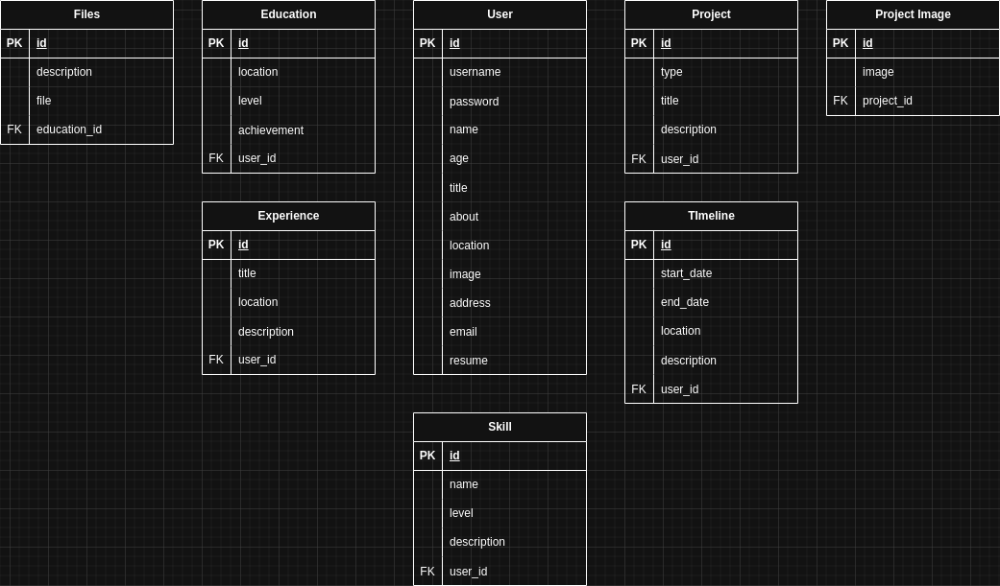

# Personal Portfolio

A Personal Portfolio Backend

## Tech Stack

-   **Laravel Framework** 8.83.29
-   **PHP** 8.3.6
-   **Docker** 28.0.4

## API Access

-   http://localhost/api/{REST_ENDPONT}

## Docker Access

1. If you use windows, please install WSL and Docker Desktop
2. If you use Linux or Mac, please install docker and docker compose v2

```bash
sudo apt install docker-compose-v2
```

3. please create .env in root folder and paste this for the configuration part

```bash
DB_CONNECTION=mysql
DB_HOST=mysql
DB_PORT=3306
DB_DATABASE=portfolio_management
DB_USERNAME=developer
DB_PASSWORD=18012001
```

4. Run docker compose up --build

### REST ENDPOINT

-   user
-   education
-   experience
-   files
-   project
-   project image
-   skill
-   timeline

### Instructions using POSTMAN

Put URL at endpoint in the environment for easy access

If you are using localhost follow the Docker Access instructions and put localhost:8080

-   for example, http://localhost:8080/api/user/{username}

View the API available below for the structure, some API required login. But you can just remove the protected routes in api.php.

Route::group(['middleware' => ['auth:sanctum']], function () {});

[Click here to view the API structure](https://www.postman.com/payload-specialist-8137764/workspace/aimanafiq-work-s/collection/33511040-223caefc-a7bb-47f4-9929-36f337ef39e5?action=share&creator=33511040&active-environment=33511040-bfecc31f-3951-40c2-9d95-753e310ce5b9)

## Screenshots

-   None at current moment

### Erd

<div>
  
</div>
